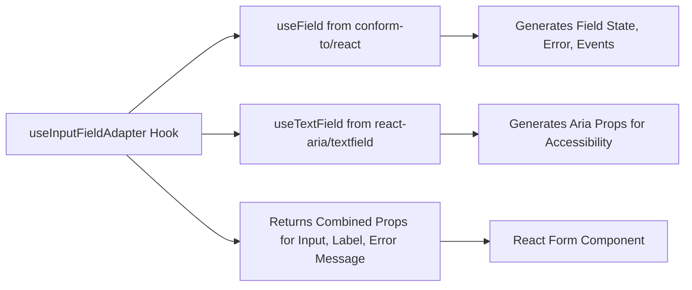

# useInputField

| [User Story on Github](https://github.com/orgs/Kurocado-Studio/projects/3/views/1?pane=issue&itemId=81815500) |
| ------------------------------------------------------------------------------------------------------------- |

The useInputFieldAdapter hook simplifies form input handling by combining React Aria’s accessibility
features with field state management from Conform.

## Key Functionality

- Field State Management: Utilizes useField from Conform to handle state, errors, and events.
- Accessibility: Leverages useTextField from React Aria to ensure ARIA attributes and accessibility
  standards.
- Merging Props: Combines additional input props using mergeProps for flexibility.

## Component Interaction Diagram

This diagram demonstrates the interaction between the different React Aria hooks (useTextField) and
Conform's useField in the useInputFieldAdapter.

